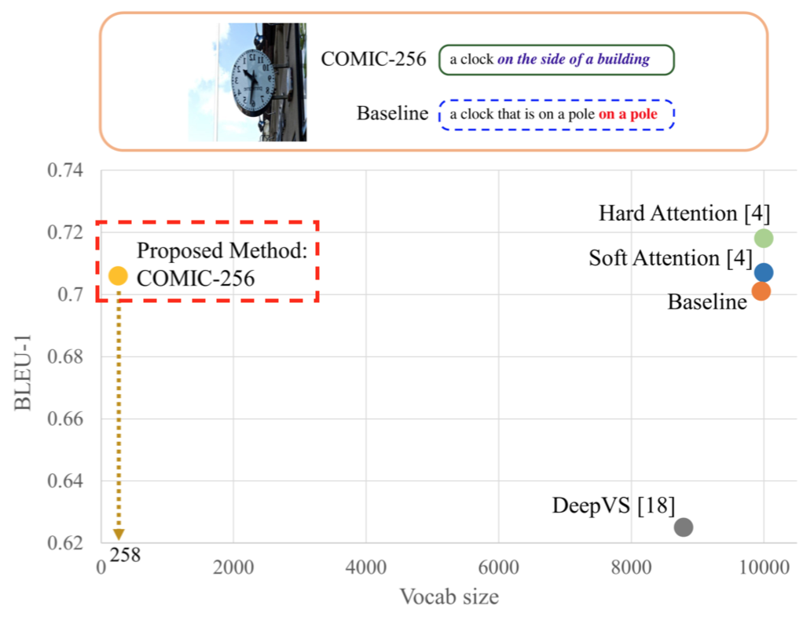

# COMIC: Towards a Compact Image Captioning Model with Attention

Updated on 25 Feb 2021: [Object Relation Transformer](https://papers.nips.cc/paper/9293-image-captioning-transforming-objects-into-words.pdf) 
with Radix encoding that can achieve CIDEr score of 1.291 after SCST training.
[Code at this repo](https://github.com/jiahuei/sparse-image-captioning).

Updated on 12 June 2019: Self-Critical Sequence Training (SCST)

Updated on 06 June 2019: Pre-trained model repo

Released on 03 June 2019.


## Description
This is the code repo of our TMM 2019 work titled 
["COMIC: Towards A Compact Image Captioning Model with Attention"](https://arxiv.org/abs/1903.01072). 
In this paper, we tackle the problem of compactness of image captioning models which is hitherto unexplored. 
We showed competitive results on both MS-COCO and InstaPIC-1.1M datasets despite having an embedding vocabularly size that is 39x-99x smaller.



**Some pre-trained model checkpoints are available at 
[this repo](https://github.com/jiahuei/COMIC-Pretrained-Captioning-Models).**


## Visualisation

You can explore and visualise generated captions [using this Streamlit app](https://github.com/jiahuei/MSCOCO-caption-explorer).


## Citation
If you find this repository useful for your research or work, please cite:

```
@article{tan2019comic,
  title={COMIC: Towards A Compact Image Captioning Model with Attention},
  author={Tan, Jia Huei and Chan, Chee Seng and Chuah, Joon Huang},
  journal={IEEE Transactions on Multimedia},
  year={2019},
  volume={21},
  number={10},
  pages={2686-2696},
  publisher={IEEE}
}
```

## Dependencies
- tensorflow 1.9.0
- python 2.7
- java 1.8.0
- tqdm >= 4.24.0
- Pillow >= 3.1.2
- requests >= 2.18.4

#### Installing Java 8 on Ubuntu
1. Download the required `tar.gz` files from Oracle:
    - [JDK 8](https://www.oracle.com/technetwork/es/java/javase/downloads/jdk8-downloads-2133151.html)
    - [JCE 8](https://www.oracle.com/technetwork/java/javase/downloads/jce8-download-2133166.html)
1. Follow instructions on [this repo](https://github.com/chrishantha/install-java/tree/63997dc81aaf9184ffe715d7381fa822bd39f357).

## Running the code
**More examples are given in `example.sh`.**

### First setup
Run `./src/setup.sh`. This will download the required Stanford models 
and run all the dataset pre-processing scripts.

### Training models
The training scheme is as follows:
1. Start with `decoder` mode (freezing the CNN)
1. Followed by `cnn_finetune` mode
1. Finally, `scst` mode

#### COMIC-256
```bash
# MS-COCO
for mode in 'decoder' 'cnn_finetune' 'scst'
do
    python train.py  \
        --train_mode ${mode}
done

# InstaPIC
for mode in 'decoder' 'cnn_finetune' 'scst'
do
    python train.py  \
        --train_mode ${mode}  \
        --dataset_file_pattern 'insta_{}_v25595_s15'  \
        --batch_size_eval 50
done
```
#### Baseline
```bash
# MS-COCO
for mode in 'decoder' 'cnn_finetune' 'scst'
do
    python train.py  \
        --train_mode ${mode}  \
        --token_type 'word'  \
        --cnn_fm_projection 'none'  \
        --attn_num_heads 1
done

# InstaPIC
for mode in 'decoder' 'cnn_finetune' 'scst'
do
    python train.py  \
        --train_mode ${mode}  \
        --dataset_file_pattern 'insta_{}_v25595_s15'  \
        --token_type 'word'  \
        --cnn_fm_projection 'none'  \
        --attn_num_heads 1  \
        --batch_size_eval 50
done
```

### Inferencing
Just point `infer.py` to the directory containing the checkpoints. 
Model configurations are loaded from `config.pkl`.

```bash
# MS-COCO
python infer.py  \
	--infer_checkpoints_dir 'mscoco/word_add_softmax_h8_tie_lstm_run_01'

# InstaPIC
python infer.py  \
	--infer_checkpoints_dir 'insta/word_add_softmax_h8_ind_lstm_run_01'  \
	--dataset_dir '/path/to/insta/dataset'  \
	--annotations_file 'insta_testval_clean.json'
```


## Project structure
```
.
+-- src
|   +-- {main scripts}
+-- common
|   +-- {shared libraries and utility functions}
+-- datasets
|   +-- preprocessing
|   |   +-- {dataset pre-processing scripts}
|   +-- {dataset folders created by pre-processing scripts, eg 'mscoco'}
+-- pretrained
    +-- {pre-trained checkpoints for some COMIC models. Details are provided in a separate README.}
```


## Avoid re-downloading datasets
Re-downloading can be avoided by:
1. Editing `setup.sh`
2. Providing the path to the directory containing the dataset files

```bash
python coco_prepro.py --dataset_dir /path/to/coco/dataset
python insta_prepro.py --dataset_dir /path/to/insta/dataset
```

In the same way, both `train.py` and `infer.py` accept alternative dataset paths.

```bash
python train.py --dataset_dir /path/to/dataset
python infer.py --dataset_dir /path/to/dataset
```

This code assumes the following dataset directory structures:

### MS-COCO
```
{coco-folder}
+-- captions
|   +-- {folder and files generated by coco_prepro.py}
+-- test2014
|   +-- {image files}
+-- train2014
|   +-- {image files}
+-- val2014
    +-- {image files}
```

### InstaPIC-1.1M
```
{insta-folder}
+-- captions
|   +-- {folder and files generated by insta_prepro.py}
+-- images
|   +-- {image files}
+-- json
    +-- insta-caption-test1.json
    +-- insta-caption-train.json
```


## Differences compared to our TMM paper
To match the settings as described in our paper, 
set the `legacy` argument of `train.py` to `True` (the default is `False`). 
This will override some of the provided arguments.

When using the default arguments, the differences compared to our TMM paper are:
- Attention map dropout is set to `0.1` instead of none
- RNN init method is changed to `x_{t=-1} = W_I * CNN(I)`
from `h_{t=-1} = W_I tanh (LN (I_{embed} ))`
- Changed training scheme (learning rate, ADAM epsilon)

Changes that can be enabled:
- CNN fine-tuning via the `train_mode` flag. Model is initialised using the 
last training checkpoint of RNN training.
- RNN variational dropout 
[[arxiv]](https://arxiv.org/abs/1512.05287)
[[tf]](https://www.tensorflow.org/versions/r1.9/api_docs/python/tf/contrib/rnn/DropoutWrapper#methods)
- Context layer (linear projection after attention)
- Self-Critical Sequence Training (SCST) [[arxiv]](https://arxiv.org/abs/1612.00563)

### Performance on MS-COCO

**Inception-V1 and LSTM:**

| Default mode      | Decoder params.   | BLEU-1    | BLEU-4    | CIDEr     | SPICE     |
| -------------     | ---------         | --------- | --------- | --------- | --------- |
| Baseline          | 12.7 M            | 0.716     | 0.311     | 0.937     | 0.174     |
| **COMIC-256**     |  4.3 M            | 0.713     | 0.308     | 0.944     | 0.176     |
| (+ CNN fine-tune) |                   | 0.729     | 0.328     | 1.001     | 0.185     |
| (+ SCST ^)        |                   | 0.753     | 0.344     | 1.050     | 0.190     |

^ SCST using beam search sampling strategy as described in [this paper](https://arxiv.org/abs/1707.07998).

| Legacy mode       | Decoder params.   | BLEU-1    | BLEU-4    | CIDEr     | SPICE     |
| -------------     | ---------         | --------- | --------- | --------- | --------- |
| Baseline          | 12.2 M            | 0.707     | 0.300     | 0.906     | 0.169     |
|                   |                   | (0.701)   | (0.296)   | (0.885)   | (0.167)   |
| **COMIC-256**     |  4.0 M            | 0.711     | 0.302     | 0.913     | 0.170     |
|                   |                   | (0.706)   | (0.292)   | (0.881)   | (0.164)   |

Note that scores in brackets () indicate figures stated in our TMM paper.
The differences are due to reimplementation from TF-1.2.

Please see [above](https://github.com/jiahuei/COMIC-Compact-Image-Captioning-with-Attention#description) 
for info on downloading checkpoints of the models listed above.

**Object Relation Transformer:**

| Default mode      | Decoder params.   | BLEU-1    | BLEU-4    | CIDEr     | SPICE     |
| -------------     | ---------         | --------- | --------- | --------- | --------- |
| Baseline          | 55.44 M           | 0.756     | 0.348     | 1.135     | 0.213     |
| **Radix**         | 45.98 M           | 0.756     | 0.349     | 1.135     | 0.209     |
| + SCST, beam = 5  |                   | 0.803     | 0.390     | 1.291     | 0.213     |

[Transformer code at this repo](https://github.com/jiahuei/sparse-image-captioning).


## Main arguments
#### train.py
- Main:
    - `train_mode`: The training regime. Choices are `decoder`, `cnn_finetune`, `scst`.
    - `token_type`: Language model. Choices are `word`, `radix`, `char`.
    - `legacy`: If `True`, will match settings as described in paper.
- CNN:
    - `cnn_name`: CNN model name.
    - `cnn_input_size`: CNN input size.
    - `cnn_fm_attention`: End point name of feature map for attention.
    - `cnn_fm_projection`: Feature map projection method. Choices are `none`, `independent`, `tied`.
- RNN:
    - `rnn_name`: Type of RNN. Choices are `LSTM`, `LN_LSTM`, `GRU`.
    - `rnn_size`: Number of RNN units.
    - `rnn_word_size`: Size of word embedding.
    - `rnn_init_method`: RNN init method. Choices are `project_hidden`, `first_input`.
    - `rnn_recurr_dropout`: If `True`, enable variational recurrent dropout.
- Attention:
    - `attn_num_heads`: Number of attention heads.
    - `attn_context_layer`: If `True`, add linear projection after multi-head attention.
    - `attn_alignment_method`: Alignment / composition method. Choices are `add_LN`, `dot`.
    - `attn_probability_fn`: Attention map probability function. Choices are `softmax`, `sigmoid`.
- SCST:
    - `scst_beam_size`: The beam size for SCST sampling.
    - `scst_weight_ciderD`: The weight for CIDEr-D metric during SCST training.
    - `scst_weight_bleu`: The weight for BLEU metrics during SCST training.

#### infer.py
- Main:
    - `infer_set`: The split to perform inference on. Choices are `test`, `valid`, `coco_test`, `coco_valid`.
    `coco_test` and `coco_valid` are for inferencing on the whole 
    `test2014` and `val2014` sets respectively. 
    These are used for MS-COCO online server evaluation.
    - `infer_checkpoints_dir`: Directory containing the checkpoint files.
    - `infer_checkpoints`: Checkpoint numbers to be evaluated. Comma-separated.
    - `annotations_file`: Annotations / reference file for calculating scores.
- Inference parameters:
    - `infer_beam_size`: Beam size of beam search. Pass `1` for greedy search.
    - `infer_length_penalty_weight`: Length penalty weight used in beam search.
    - `infer_max_length`: Maximum caption length allowed during inference.
    - `batch_size_infer`: Inference batch size for parallelism.


## Microsoft COCO Caption Evaluation
This code uses the standard `coco-caption` code with *SPICE* metric
[[Link to repo]](https://github.com/tylin/coco-caption/tree/3a9afb2682141a03e1cdc02b0df6770d2c884f6f).


To perform online server evaluation:
1. Infer on `coco_test` (test2014), rename the JSON output file to `captions_test2014__results.json`.
2. Infer on `coco_valid` (val2014), rename the JSON output file to `captions_val2014__results.json`.
3. Zip the files and submit.


## Acknowledgements
Thanks to the developers of:
- [[attend2u]](https://github.com/cesc-park/attend2u/tree/c1185e550c72f71daa74a6ac95791cbf33363b27)
- [[coco-caption]](https://github.com/tylin/coco-caption/tree/3a9afb2682141a03e1cdc02b0df6770d2c884f6f)
- [[ruotianluo/self-critical.pytorch]](https://github.com/ruotianluo/self-critical.pytorch/tree/77dff3223ba2fefe26047ff6ef560c2aa0e1f942)
- [[ruotianluo/cider]](https://github.com/ruotianluo/cider/tree/dbb3960165d86202ed3c417b412a000fc8e717f3)
- [[weili-ict/SelfCriticalSequenceTraining-tensorflow]](https://github.com/weili-ict/SelfCriticalSequenceTraining-tensorflow/tree/cddf3f99bbd5b7ed96c12c6415fb6ae641d4816f)
- [[tensorflow]](https://github.com/tensorflow)


## Feedback
Suggestions and opinions (both positive and negative) are greatly welcomed. 
Please contact the authors by sending an email to 
`tan.jia.huei at gmail.com` or `cs.chan at um.edu.my`.


## License and Copyright
The project is open source under BSD-3 license (see the `LICENSE` file).

&#169; 2019 Center of Image and Signal Processing, 
Faculty of Computer Science and Information Technology, University of Malaya.


